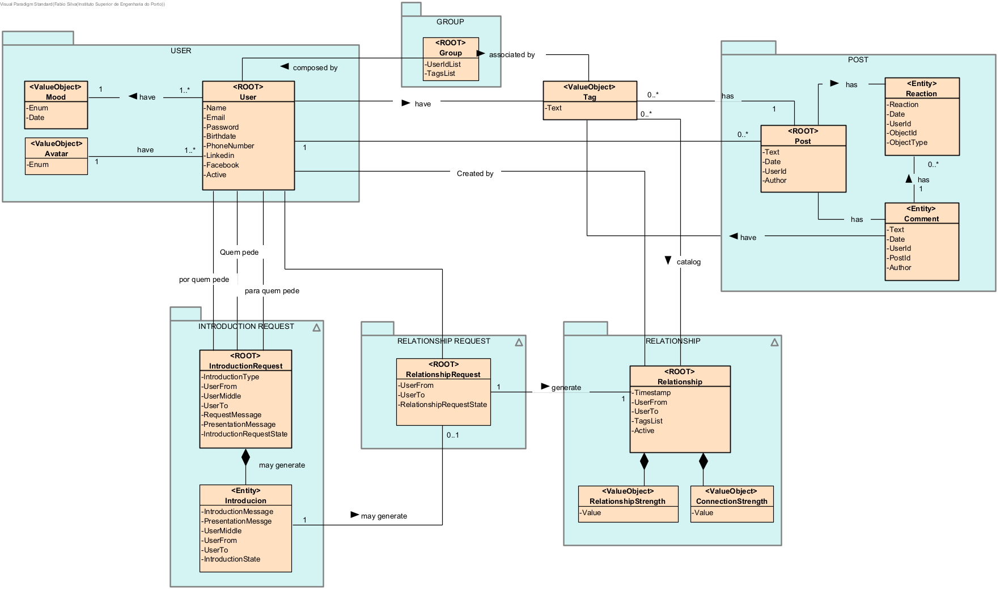

# Background

# Architecture Background

***toDo***

## Problem Background

### System Overview

Projeto da edição 2021/2022 de Laboratório Projeto 5 (LAPR5) da Licenciatura em Engenharia Informática do ISEP.

Pretende-se o desenvolvimento de um protótipo para um jogo baseado na visualização e manipulação de grafos sociais.
O protótipo inicial será ser constituído pelos seguintes módulos:
    -  Jogo 3D com componentes de inteligência artificial
    -  Gestão de rede social e dados mestres
    -  Leaderboard e consultas

### Context

***toDo***

### Driving requirements

#### Functional requirements

    |----|----------------------------------------------------------------|
    | UC | DESIGNAÇÃO                                                     |
    |----|----------------------------------------------------------------|
    | 3  | editar relacionamento com tags e força de ligação              |
    | 5  | editar perfil próprio                                          |
    | 6  | editar estado de humor                                         |
    | 7  | consultar a rede a partir da sua perspetiva                    |
    | 8  | registar utilizador no sistema                                 |
    | 9  | escolher “utilizadores objetivo” (sugeridos pelo sistema)      |
    |10  | pesquisar utilizadores na rede, e pedir ligação de utilizador  |
    |11  | pedir introdução a utilizador objetivo                         |
    |12  | aprovar/desaprovar pedido de introdução                        |
    |33  | aceitar ou rejeitar a introdução                               |
    |35  | obter lista de pedidos de ligação pendentes                    |
    |----|----------------------------------------------------------------|

#### Quality attributes

##### **Funcionalidade**

***toDo***

##### **Usabilidade**

***toDo***

##### **Confiabilidade (Reliability)**

***toDo***

##### **Desempenho (Performance)**

***toDo***

##### **Suportabilidade**

***toDo***

##### **Design Constraints**

***toDo***

##### **Implementation constraints**

***toDo***

##### **Interface constraints**

***toDo***

##### **Physical constraints**

***toDo***

## Solution Background
### **Architectural Approaches**

***toDo***

### **Analysis Results**

***toDo***

### **Mapping Requirements to Architecture**

***toDo***

--------------------------------------------------------

# Views

Será adotada a combinação de dois modelos de representação arquitetural: C4 e 4+1.

O Modelo de Vistas 4+1 [[Krutchen-1995]](References.md#Kruchten-1995) propõe a descrição do sistema através de vistas complementares permitindo assim analisar separadamente os requisitos dos vários stakeholders do software, tais como utilizadores, administradores de sistemas, project managers, arquitetos e programadores. As vistas são deste modo definidas da seguinte forma:

- Vista lógica: relativa aos aspetos do software visando responder aos desafios do negócio;
- Vista de processos: relativa ao fluxo de processos ou interações no sistema;
- Vista de desenvolvimento: relativa à organização do software no seu ambiente de desenvolvimento;
- Vista física: relativa ao mapeamento dos vários componentes do software em hardware, i.e. onde é executado o software;
- Vista de cenários: relativa à associação de processos de negócio com atores capazes de os espoletar.

O Modelo C4 [[Brown-2020]](References.md#Brown-2020)[[C4-2020]](References.md#C4-2020) defende a descrição do software através de quatro níveis de abstração: sistema, contentor, componente e código. Cada nível adota uma granularidade mais fina que o nível que o antecede, dando assim acesso a mais detalhe de uma parte mais pequena do sistema. Estes níveis podem ser equiparáveis a mapas, e.g. a vista de sistema corresponde ao globo, a vista de contentor corresponde ao mapa de cada continente, a vista de componentes ao mapa de cada país e a vista de código ao mapa de estradas e bairros de cada cidade.
Diferentes níveis permitem contar histórias diferentes a audiências distintas.

Os níveis encontram-se definidos da seguinte forma:
  - Nível 1: Descrição (enquadramento) do sistema como um todo;
  - Nível 2: Descrição de contentores do sistema;
  - Nível 3: Descrição de componentes dos contentores;
  - Nível 4: Descrição do código ou partes mais pequenas dos componentes (e como tal, não será abordado neste DAS/SAD).

Pode-se dizer que estes dois modelos se expandem ao longo de eixos distintos, sendo que o Modelo C4 apresenta o sistema com diferentes níveis de detalhe e o Modelo de Vista 4+1 apresenta o sistema de diferentes perspetivas. Ao combinar os dois modelos torna-se possível representar o sistema de diversas perspetivas, cada uma com vários níveis de detalhe.

Para modelar/representar visualmente, tanto o que foi implementado como as ideias e alternativas consideradas, recorre-se à Unified Modeling Language (UML) [[UML-2020]](References.md#UML-2020) [[UMLDiagrams-2020]](References.md#UMLDiagrams-2020).

## Nível 1
  - [Vista de Cenário](./Documents/Wiki/Diagrams/Level_1/Vista de Cenario/Vista de Cenario.png)
  - [Vista Lógica](./Documents/Wiki/Diagrams/Level_1/Vista Logica/Vista Logica.png)
  - **Vista de Processos**
    - [UC03](./Documents/Wiki/Diagrams/Level_1/Vista de Processos/UC03/UC03.jpg)
    - [UC05](./Documents/Wiki/Diagrams/Level_1/Vista de Processos/UC05/UC05.png)
    - [UC06](./Documents/Wiki/Diagrams/Level_1/Vista de Processos/UC06/UC06.png)
    - [UC07](./Documents/Wiki/Diagrams/Level_1/Vista de Processos/UC07/UC07.png)
    - [UC08](./Documents/Wiki/Diagrams/Level_1/Vista de Processos/UC08/UC08.png)
    - [UC09](./Documents/Wiki/Diagrams/Level_1/Vista de Processos/UC09/UC09.png)
    - [UC10](./Documents/Wiki/Diagrams/Level_1/Vista de Processos/UC10/UC10.png)
    - [UC11](./Documents/Wiki/Diagrams/Level_1/Vista de Processos/UC11/UC11.png)
    - [UC12](./Documents/Wiki/Diagrams/Level_1/Vista de Processos/UC12/UC12.jpg)
    - [UC33](./Documents/Wiki/Diagrams/Level_1/Vista de Processos/UC33/UC33.png)
    - [UC35](./Documents/Wiki/Diagrams/Level_1/Vista de Processos/UC35/UC35.jpg)

## Nível 2
  - [Vista Lógica](./Documents/Wiki/Diagrams/Level_2/Vista Logica/Vista Logica.png)
  - [Vista Física](./Documents/Wiki/Diagrams/Level_2/Vista Fisica/Vista Fisica.png)
  - [Vista de Implementação](./Documents/Wiki/Diagrams/Level_2/Vista de Implementacao/Vista de Implementacao.png)
  - **Vista de Processos**
    - [UC03](./Documents/Wiki/Diagrams/Level_2/Vista de Processos/UC03/UC03.png)
    - [UC05](./Documents/Wiki/Diagrams/Level_2/Vista de Processos/UC05/UC05.png)
    - [UC06](./Documents/Wiki/Diagrams/Level_2/Vista de Processos/UC06/UC06.png)
    - [UC07](./Documents/Wiki/Diagrams/Level_2/Vista de Processos/UC07/UC07.png)
    - [UC08](./Documents/Wiki/Diagrams/Level_2/Vista de Processos/UC08/UC08.png)
    - [UC09](./Documents/Wiki/Diagrams/Level_2/Vista de Processos/UC09/UC09.png)
    - [UC10](./Documents/Wiki/Diagrams/Level_2/Vista de Processos/UC10/UC10.png)
    - [UC11](./Documents/Wiki/Diagrams/Level_2/Vista de Processos/UC11/UC11.png)
    - [UC12](./Documents/Wiki/Diagrams/Level_2/Vista de Processos/UC12/UC12.png)
    - [UC33](./Documents/Wiki/Diagrams/Level_2/Vista de Processos/UC33/UC33.png)
    - [UC35](./Documents/Wiki/Diagrams/Level_2/Vista de Processos/UC35/UC35.png)

## Nível 3
  - [Vista Lógica](./Documents/Wiki/Diagrams/Level_3/Vista Logica/Vista Logica.png)
  - [Vista Física]()
  - [Vista de Implementação](./Documents/Wiki/Diagrams/Level_3/Vista de Implementacao/Vista de Implementacao.png)
  - **Vista de Processos**
    - [UC03](./Documents/Wiki/Diagrams/Level_3/Vista de Processos/UC03/UC03.png)
    - [UC05](./Documents/Wiki/Diagrams/Level_3/Vista de Processos/UC05/UC05.png)
    - [UC06](./Documents/Wiki/Diagrams/Level_3/Vista de Processos/UC06/UC06.png)
    - [UC07](./Documents/Wiki/Diagrams/Level_3/Vista de Processos/UC07/UC07.jpg)
    - [UC08](./Documents/Wiki/Diagrams/Level_3/Vista de Processos/UC08/UC08.jpg)
    - [UC09](./Documents/Wiki/Diagrams/Level_3/Vista de Processos/UC09/UC09.png)
    - [UC10](./Documents/Wiki/Diagrams/Level_3/Vista de Processos/UC10/UC10.png)
    - [UC11](./Documents/Wiki/Diagrams/Level_3/Vista de Processos/UC11/UC11.png)
    - [UC12](./Documents/Wiki/Diagrams/Level_3/Vista de Processos/UC12/UC12.png)
    - [UC33](./Documents/Wiki/Diagrams/Level_3/Vista de Processos/UC33/UC33.png)
    - [UC35](./Documents/Wiki/Diagrams/Level_3/Vista de Processos/UC35/UC35.png)

-------------------------------------------------

## Modelo de Domínio

  *Os agregados estão especificados em azul e a vermelho estão as componentes não integradas neste sprint*

--------------------------------------------------------

# Mapping between Views

- **Nivel 1**
    - [Vista lógica - Vista de implementação]()
    - [Vista de implementação - Vista física]()
- **Nivel 2**
    - [Vista lógica - Vista de implementação](./Documents/Wiki/Diagrams/Level_2/Mapping Between Views/Vista de Implementação - Vista Logica.png)
    - [Vista de implementação - Vista física](./Documents/Wiki/Diagrams/Level_2/Mapping Between Views/Vista de Implementação - Vista Fisica.png)
- **Nivel 3**
    - [Vista lógica - Vista de implementação]()
    - [Vista de implementação - Vista física]()

--------------------------------------------------------

# Referenced Materials

* [React Js](https://reactjs.org/)
* [Three.js](https://threejs.org/)
* [Docker](https://www.docker.com/)
* [Microsoft Azure](https://azure.microsoft.com/pt-pt/)
* [XML-JSON](https://www.npmjs.com/package/xml-js)

--------------------------------------------------------

# Glossary and Acronyms

* **DDD** - Domain Driver Design
* **DTO** - Data Transfer Object
* **API** - Application Programming Interface
* **AI**  - inteligência Artificial

--------------------------------------------------------

# Autores

* **Carlos Moutinho** - *1140858*
* **Rui Marinho** - *1171602*
* **Rafael Soares** - *1181882*
* **Sara Silva** - *1181892*
* **Fábio Silva** - *1181895*

--------------------------------------------------------
